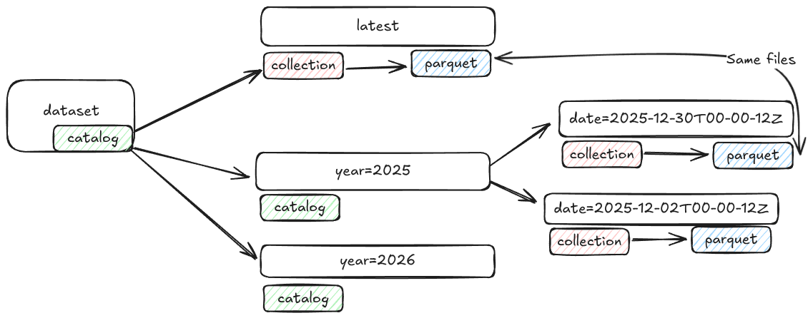

# Topographic System

The topographic system is a collection of components that are used to create New Zealand's Topographic mapping products such as NZTopo50 https://www.linz.govt.nz/products-services/maps/new-zealand-topographic-maps

## Topographic Map Production

Topographic maps are produced with [QGIS](https://github.com/qgis/qgis). All of the QGIS project files and assets are store in [linz/topographic-qgis](https://github.com/linz/topographic-qgis)

The map production workflow automates the production of all map sheets rendering the maps with a Headless QGIS inside of docker.

- [map prepare](../packages/map/README.md) - Prepare a map export run, creating immutable STAC based version of the dataset in S3, suitable for long term storage and versioning
- [map export](../packages/map/README.md) - Export one or many map sheets from a map preperation
- [stac push](../packages/stac/README.md) - Push the exported assets into a STAC Catalog

## Topographic Data Editing

All editable topographic data is stored as [kart](https://github.com/koordinates/kart) repositories roughly broken down into a similar groups, some large datasets (contours) are in seperate repositories due to performance impacts of their size

### Topographic datasets

- [linz/topographic-data](https://github.com/linz/topographic-data) - Topographic data eg `water` or `airport`
- [linz/topographic-product-data](https://github.com/linz/topographic-product-data) - Product specific datasets (eg `nz_topo50_map_sheet`)
- [linz/topographic-contour-data](https://github.com/linz/topographic-contour-data) - Topo50 Contour lines

### Data flow

Before data is merged into these kart repositories, Github actions is used to ensure data quality and consistent map production using a standard pull request based git flow.

- [map visual-diff](../packages/map/README.md) - Export NZTopo50 map sheets and diff the results
- [kart validate](../packages/kart/README.md) - Validate parquet data matches the topographic schemas
- [kart to-parquet](../packages/kart//README.md) - Convert and optimize the parquet datasets

Once the data is merged into master the data is exported as geoparquet and stored into S3 for use in the [map production system](#topographic-map-production)

- [stac push](../packages/stac/README.md) - Push the STAC and assets into the STAC catalogue in S3

### Data Storage

Data is stored as a immutable date based system, `/data/airport/year=2026/date=2026-09-03T00-00-00Z/airport.parquet`. and also a mutable latest folder `/data/airport/latest/` that points to the latest date based version. More information on the [storage structure](./storage.structure.md)

