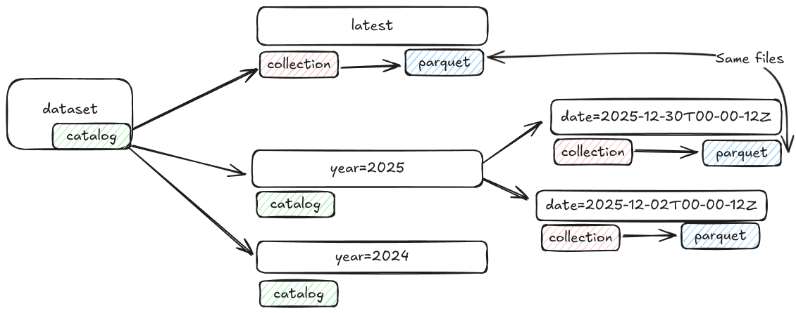
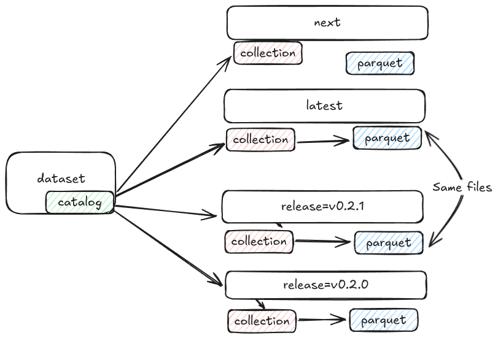

# System Storage

The topographic system has a number of independently versioned components that are all stored into the same storage location, All components have associated STAC metadata

Key components across all storage structures

- `latest/` The latest "released" copy of the component,
- `next/` (Optional) The next release,
- `/thumbnail.webp` - (Optional) A image representation of the component
- `/covering.geojson` - (Optional) A complex feature representing a detailed

A component may opt into multiple storage structures, such as both "date" and "pull_request" where merging to master deploys the "date" structure and pull requests deploy the "pull_request" structure.

## Date based versioning - "date"

For a dataset where commits to the master record (table or kart repository), as records are updated on the master they are exported at fixed times which could be hourly, daily or on every update.

With a attempt to keep the number of items per folder under 1000, multiple levels of hierarchy for the date could be used, for rough guide lines

- `year=2026` - A few times a day 5 days a week
- `year=2026/month=12` - Every hour
- `year=2026/month=12/day=01` - Every minute

To keep the date based versions immutable a full ISO timestamp of the published record should also be stored

```
year=2026/date=2026-01-01T12_00_00Z/collection.json
```



An example structure of a vector date based versioning structure

```yaml
example-bucket:
  - catalog.json

  - airport:
      - catalog.json

      - latest: # Mutable latest released copy
          - collection.json # References to the latest immutable tag year=2026/date=2026-03-01T12-00-00Z:
          - airport.parquet

      - year=2026: # Immutable releases that have been specifically tagged (eg a daily release)
          - catalog.json
          - date=2026-03-01T12-00-00Z:
              - collection.json
              - airport.parquet

      - year=2025:
          - catalog.json
          - date=2025-10-01T12-00-00Z:
              - collection.json
              - airport.parquet
```

### Release based Versioning - "release"

For components that have a fixed release process such as semver or a quarterly release, it is recommended to store in a similar structure as date based versioning with the addition of `next/` to store the next development release.



```yaml
example-bucket:
  - catalog.json
  - airport:
      - catalog.json

      - next: # Mutable development version (eg nightly)
          - collection.json
          - airport.parquet

      - latest: # Mutable latest released copy
          - collection.json # references immutable tag eg `release=v0.0.1/collection.json`
          - airport.parquet

      - release=v0.0.1: # Immutable tagged releases
          - collection.json
          - airport.parquet
```

### Git context

For components that are deployed into storage from a git environment and need to be accessed from unpublished locations (eg pull requests or commits) these component can be stored against their git context.

#### Commit - "commit"

Commits are shared into `commit_prefix=${0-f}` to prevent their folders from growing too large, for very large git repositories a larger shard `commit_prefix=${00-ff}` could be used.

```yaml
- commit_prefix=3: # Immutable
    - catalog.json

    - commit=36125a7fbbae012f2809c5f8c3af6a2363c0a305:
        - collection.json
        - airport.parquet

    - commit=3dfee564ea82f3da4ae16b84f5fe4a833e4c89d1:
        - collection.json
        - airport.parquet

- commit_prefix=4: # Immutable
    - catalog.json

    - commit=4aba34b5accb0002867af66f6a92a35e0a4be7ca:
        - collection.json
        - airport.parquet
```

#### Pull Request - "pull_request"

```yaml
- pull_request=1: # Mutable - updates as pull request updates
    - collection.json
    - airport.parquet # links to commit=36125a7fbbae012f2809c5f8c3af6a2363c0a305

- pull_request=2: # Mutable
    - collection.json
    - airport.parquet # links to commit=4aba34b5accb0002867af66f6a92a35e0a4be7ca
```
